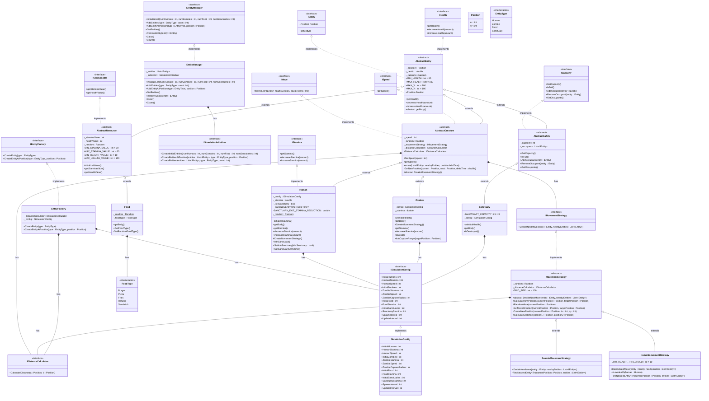

```mermaid
classDiagram
    %% Interfaces
    class IEntity {
        <<interface>>
        +Position Position
        +getBody()
    }

    class IHealth {
        <<interface>>
        +getHealth()
        +decreaseHealth(amount)
        +increaseHealth(amount)
    }

    class IMove {
        <<interface>>
        +move(List~IEntity~ nearbyEntities, double deltaTime)
    }

    class ISpeed {
        <<interface>>
        +getSpeed()
    }

    class IStamina {
        <<interface>>
        +getStamina()
        +decreaseStamina(amount)
        +increaseStamina(amount)
    }

    class IConsumable {
        <<interface>>
        +getStaminaValue()
        +getHealthValue()
    }

    class ICapacity {
        <<interface>>
        +GetCapacity()
        +IsFull()
        +AddOccupant(entity : IEntity)
        +RemoveOccupant(entity : IEntity)
        +GetOccupants()
    }

    class IMovementStrategy {
        <<interface>>
        +DecideNextMove(entity : IEntity, nearbyEntities : List~IEntity~)
    }

    class IDistanceCalculator {
        <<interface>>
        +CalculateDistance(a : Position, b : Position)
    }

    class IEntityFactory {
        <<interface>>
        +CreateEntity(type : EntityType)
        +CreateEntityAtPosition(type : EntityType, position : Position)
    }

    class IEntityManager {
        <<interface>>
        +InitializeList(numHumans : int, numZombies : int, numFood : int, numSanctuaries : int)
        +AddEntities(type : EntityType, count : int)
        +AddEntityAtPosition(type : EntityType, position : Position)
        +GetEntities()
        +RemoveEntity(entity : IEntity)
        +Clear()
        +Count()
    }

    class ISimulationInitializer {
        <<interface>>
        +CreateInitialEntities(numHumans : int, numZombies : int, numFood : int, numSanctuaries : int)
        +CreateEntitiesAtPosition(entities : List~IEntity~, type : EntityType, position : Position)
        +CreateEntities(entities : List~IEntity~, type : EntityType, count : int)
    }

    class ISimulationConfig {
        <<interface>>
        +InitialHumans : int
        +HumanStamina : int
        +HumanSpeed : int
        +InitialZombies : int
        +ZombieStamina : int
        +ZombieSpeed : int
        +ZombieCaptureRadius : int
        +InitialFood : int
        +FoodStamina : int
        +InitialSanctuaries : int
        +SanctuaryStamina : int
        +SpawnInterval : int
        +UpdateInterval : int
    }

    %% Factory Classes
    class EntityFactory {
        -_distanceCalculator : IDistanceCalculator
        -_config : ISimulationConfig
        +CreateEntity(type : EntityType)
        +CreateEntityAtPosition(type : EntityType, position : Position)
    }

    class EntityManager {
        -_entities : List~IEntity~
        -_initializer : ISimulationInitializer
        +InitializeList(numHumans : int, numZombies : int, numFood : int, numSanctuaries : int)
        +AddEntities(type : EntityType, count : int)
        +AddEntityAtPosition(type : EntityType, position : Position)
        +GetEntities()
        +RemoveEntity(entity : IEntity)
        +Clear()
        +Count()
    }

    %% Abstract Classes
    class AbstractEntity {
        <<abstract>>
        -_position : Position
        -_health : double
        -_random : Random$
        +MIN_HEALTH : int = 80
        +MAX_HEALTH : int = 100
        +MAX_X : int = 100
        +MAX_Y : int = 100
        +Position Position
        +getHealth()
        +decreaseHealth(amount)
        +increaseHealth(amount)
        +abstract getBody()
    }

    class AbstractCreature {
        <<abstract>>
        -_speed : int
        -_random : Random$
        -_movementStrategy : IMovementStrategy
        -_distanceCalculator : IDistanceCalculator
        #DistanceCalculator : IDistanceCalculator
        #SetSpeed(speed : int)
        +getSpeed()
        +move(List~IEntity~ nearbyEntities, double deltaTime)
        -GetNewPosition(current : Position, next : Position, deltaTime : double)
        #abstract CreateMovementStrategy()
    }

    class AbstractResource {
        <<abstract>>
        -_staminaValue : int
        -_healthValue : int
        -_random : Random
        -MIN_STAMINA_VALUE : int = 30
        -MAX_STAMINA_VALUE : int = 60
        -MIN_HEALTH_VALUE : int = 10
        -MAX_HEALTH_VALUE : int = 100
        -InitializeValues()
        +getStaminaValue()
        +getHealthValue()
    }

    class AbstractSafety {
        <<abstract>>
        -_capacity : int
        -_occupants : List~IEntity~
        +GetCapacity()
        +IsFull()
        +AddOccupant(entity : IEntity)
        +RemoveOccupant(entity : IEntity)
        +GetOccupants()
    }

    class MovementStrategy {
        <<abstract>>
        -_random : Random
        -_distanceCalculator : IDistanceCalculator
        -GRID_SIZE : int = 100
        +abstract DecideNextMove(entity : IEntity, nearbyEntities : List~IEntity~)
        #CalculateNewPosition(currentPosition : Position, targetPosition : Position)
        #RandomMove(currentPosition : Position)
        -GetMoveDirection(currentPosition : Position, targetPosition : Position)
        -CreateNewPosition(currentPosition : Position, dx : int, dy : int)
        #CalculateDistance(position1 : Position, position2 : Position)
    }

    %% Concrete Classes
    class Position {
        +x : int
        +y : int
    }

    class SimulationConfig {
        +InitialHumans : int
        +HumanStamina : int
        +HumanSpeed : int
        +InitialZombies : int
        +ZombieStamina : int
        +ZombieSpeed : int
        +ZombieCaptureRadius : int
        +InitialFood : int
        +FoodStamina : int
        +InitialSanctuaries : int
        +SanctuaryStamina : int
        +SpawnInterval : int
        +UpdateInterval : int
    }

    class Human {
        -_config : ISimulationConfig
        -_stamina : double
        -_isInSanctuary : bool
        -_sanctuaryEntryTime : DateTime?
        -SANCTUARY_EXIT_STAMINA_REDUCTION : double
        -_random : Random$
        -InitializeStamina()
        +getBody()
        +getStamina()
        +decreaseStamina(amount)
        +increaseStamina(amount)
        #CreateMovementStrategy()
        +IsInSanctuary()
        +SetIsInSanctuary(isInSanctuary : bool)
        +GetSanctuaryEntryTime()
    }

    class Zombie {
        -_config : ISimulationConfig
        -_stamina : double
        -setInitialHealth()
        +getBody()
        #CreateMovementStrategy()
        +getStamina()
        +decreaseStamina(amount)
        +isDead()
        +IsInCaptureRange(targetPosition : Position)
    }

    class Food {
        -_random : Random$
        -_foodType : FoodType
        +getBody()
        +GetFoodType()
        -GetRandomFoodType()
    }

    class Sanctuary {
        -SANCTUARY_CAPACITY : int = 3
        -_config : ISimulationConfig
        -setInitialHealth()
        +getBody()
        +isDestroyed()
    }

    class HumanMovementStrategy {
        -LOW_HEALTH_THRESHOLD : int = 10
        +DecideNextMove(entity : IEntity, nearbyEntities : List~IEntity~)
        -IsLowHealth(human : Human)
        -FindNearestEntity~T~(currentPosition : Position, entities : List~IEntity~)
    }

    class ZombieMovementStrategy {
        +DecideNextMove(entity : IEntity, nearbyEntities : List~IEntity~)
        -FindNearestEntity~T~(currentPosition : Position, entities : List~IEntity~)
    }

    %% Enums
    class EntityType {
        <<enumeration>>
        Human
        Zombie
        Food
        Sanctuary
    }

    class FoodType {
        <<enumeration>>
        Burger
        Pizza
        Fries
        HotDog
        Sandwich
    }

    %% Relationships
    IEntity <|.. AbstractEntity : implements
    IHealth <|.. AbstractEntity : implements
    IMove <|.. AbstractCreature : implements
    ISpeed <|.. AbstractCreature : implements
    IStamina <|.. Human : implements
    IConsumable <|.. AbstractResource : implements
    ICapacity <|.. AbstractSafety : implements
    ISimulationConfig <|.. SimulationConfig : implements
    IMovementStrategy <|.. MovementStrategy : implements
    IEntityFactory <|.. EntityFactory : implements
    IEntityManager <|.. EntityManager : implements

    AbstractEntity <|-- AbstractCreature : extends
    AbstractEntity <|-- AbstractResource : extends
    AbstractEntity <|-- AbstractSafety : extends

    AbstractCreature <|-- Human : extends
    AbstractCreature <|-- Zombie : extends

    AbstractResource <|-- Food : extends
    AbstractSafety <|-- Sanctuary : extends

    MovementStrategy <|-- HumanMovementStrategy : extends
    MovementStrategy <|-- ZombieMovementStrategy : extends

    Food *-- FoodType : has
    AbstractCreature *-- IMovementStrategy : has
    AbstractCreature *-- IDistanceCalculator : has
    MovementStrategy *-- IDistanceCalculator : has
    EntityFactory *-- IDistanceCalculator : has
    EntityFactory *-- ISimulationConfig : has
    EntityManager *-- ISimulationInitializer : has
    Human *-- ISimulationConfig : has
    Zombie *-- ISimulationConfig : has
    Sanctuary *-- ISimulationConfig : has
```